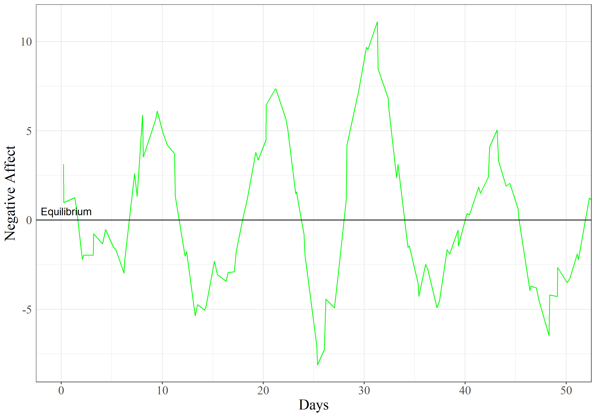

This page contains an illustrative example on how to fit the **Damped Linear Oscillator model** to a single individual's negative affect measures. This example was conceived as a supplementary material to (reference). Please access (link) for more details. 

# Previous steps 

*R* and *Rstudio* are needed and can be downloaded from [here](https://www.rstudio.com/products/rstudio/download/).  

Once *R* and *Rstudio* are installed. *OpenMx* package is required, to install and load the package: 
```{r, eval=F}
install.packages ("OpenMx")

```
```{r}
library ("OpenMx")

```


# Data

The data used in this tutorial is available for download [here]('DLO_Tutorial_Individual.Rdata'). Now, to load the data and see the first lines of it: 
```{r}
load ('DLO_Tutorial_Individual.Rdata')
head (simdata)
```

The data set has 3 variables: 

* **y1** is the score in negative affect at one point in time. 
* **times** is the moment when the measurement occasion was collected. This data set contains two measurement occasions per day within the same 12 hours everyday. The individual was measured for 60 days. 
* **id** is a variable that indicates to which subject the measurements correspond. This data belongs to one individual. 

Here is a figure that depicts the scores of the individual under study over time:  
 
 
# Fit Damped Linear Oscillator

Now to estimate the Damped Linear Oscillator model, the following code is used: 
```{r, message=F}
cdim <- list("y1", c('Position', 'Velocity'))
xdim <- 2
udim <- 1
ydim <- 1

amat <- mxMatrix('Full', xdim, xdim, 
                 c(F, T, F, T), c(0, -.7, 1, -.3), name='A', 
                 labels = c(NA, "k", NA, "c"), 
                 lbound = c (NA, -2, NA, -2), 
                 ubound= c (NA, 0, NA, 0))

bmat <- mxMatrix('Full', xdim, udim, 
                 c (F, F) , c (1,0), name='B')

cmat <- mxMatrix('Full', ydim, xdim, 
                 c (F, F), values=c(1, 0), name='C', dimnames=cdim)

dmat <- mxMatrix('Zero', udim, udim, name='D')

qmat <- mxMatrix('Diag', xdim, xdim, 
                 c(F,T), c(0,3), name='Q', 
                 labels= c(NA, "q"), 
                 lbound=1e-20)

rmat <- mxMatrix('Diag', ydim, ydim, 
                 T , 0, name='R', 
                 labels= c ("r"), 
                 lbound=1e-20)

xmat <- mxMatrix('Full', xdim, 1,
                 c(T,F), c(0, 1), name='x0', 
                 labels= c("ini", NA))

pmat <- mxMatrix('Diag', xdim, xdim,
                 F, 1, name='P0')

umat <- mxMatrix('Zero', udim, 1, name='u')

tmat <- mxMatrix('Full', 
                 1, 1, name='time', 
                 labels='data.times')

dlo <- mxModel("DampedLinearOscillator", 
               amat, bmat, cmat, dmat, qmat, rmat, xmat, pmat, umat, tmat,
               mxExpectationStateSpaceContinuousTime('A', 'B', 'C', 'D', 
                                                     'Q', 'R', 'x0', 'P0',
                                                     'u', t='time'),
               mxFitFunctionML())

dlod <- mxModel(dlo, mxData(simdata, 'raw'))
dlo_out <- mxRun(dlod)
```

And to access the results: 

```{r}
summary(dlo_out)
```


